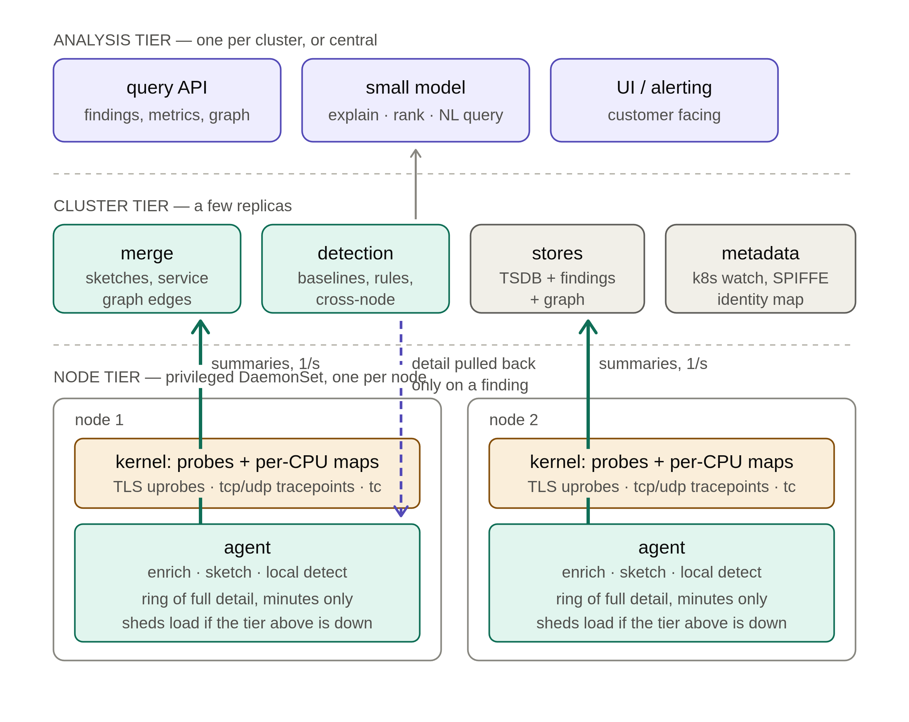

### Monitoring System Proposal

## Requirements
 - Monitoring should feed information to UI shown in Chris's mockups
 - Monitoring system should work with minimal configuration on:
   - Raw Kubernetes
   - Istio inside Kubernetes
   - Greymatter
   - Kumu
   - Bare metal EC2, Azure, OSX
   - Plain Envoy environments outside Kubernetes(docker, ...)
 - Monitoring should be orthogonal to environment(i.e the monitored environment has no knowledge of its being monitored.)
 - System should be able to monitor TCP applications, HTTP applications, and UDP applications
 - For each of those three environments there will be a specialized collection mechanism
 - There will also be a mechanism for parsing custom data structures like the banking thingy, ,mention the others as well 

## Design Considerations

 # Don't send captured data to the model

    At any real traffic volume this fails three ways at once: the token cost is ruinous, 
    inference can't keep up with line rate, and — most importantly — language models are bad at the actual job. 
    Finding a p99 regression is arithmetic over a distribution. Detecting a port scan is counting distinct 
    destinations in a window. A model reading logs will do both worse than ten lines of code, and will occasionally 
    invent a finding, which for a security product is disqualifying.

    Put the model at the end, on findings rather than data:

    Explanation — "checkout p99 tripled at 14:02; payments began returning 503 at 14:01; 89% of checkout's latency is time waiting on payments"
    Ranking and deduplication — forty findings into three that matter
    Natural-language query — turn "what changed in payments this morning" into a query against your store, and the results back into prose
    Report generation for customers who won't read a dashboard

    Everything the customer trusts should be computed deterministically and be auditable. The model makes it readable. If a finding can't be traced back to a number, don't show it.
    This also solves your performance requirement for free — a model running at ten findings per minute is trivially affordable, on-prem, no egress.

 # Performance specifics

    Aggregate in-kernel. The dominant cost is copying events to userspace. BPF maps as per-CPU histograms and counters mean you export summaries, not events. 
    Reserve full event capture for sampled flows or when something is already known to be interesting.
    BPF ring buffer, not perf buffer — better memory behaviour and ordering.

    Adaptive sampling. 1-in-1000 baseline, escalating to full capture on error status or latency outliers. You want detail exactly when something is wrong, 
    which is when volume is lowest.

    Sketches, not raw retention. t-digest for percentiles, count-min for frequencies, HyperLogLog for cardinality. Bounded memory, 
    mergeable across nodes, good enough for every question you'll actually ask.

    CO-RE via libbpf, not BCC. Compile once, run on any kernel with BTF. BCC compiles on the node at load time and drags in LLM — unacceptable for a shipped product.

# Three things that will actually be hard

    Uprobe brittleness. Probes attach to symbols in specific library builds. Statically linked Go binaries, stripped builds, unusual BoringSSL versions 
    — any of these means no visibility, and the failure is silent. You need explicit coverage detection and a way to tell customers 
    "we can't see workload X," or you'll ship a product that quietly under-reports.

    You're a privileged DaemonSet. eBPF can't be namespaced; tracing helpers can read arbitrary kernel memory. Your agent is a host-root component on 
    every node in a customer's cluster, and you should expect to be asked hard questions about it. Look at BPF token (kernel 6.9+) for a delegation story, 
    but runtime support is still thin.

    Causality is not correlation, and customers will conflate them. eBPF gives you concurrent events; it does not give you the call graph. 
    "A failed and B failed" is not "A caused B" unless you have trace context linking them. Either propagate W3C traceparent — which all four meshes can emit — 
    or be explicit in the UI that you're showing correlation. Getting this wrong is how the product loses credibility on its first real incident.

# What I'd build first

    A single-node prototype: BoringSSL uprobes, HTTP parsing, per-service latency histograms in a BPF map, exported once a second. 
    Run it under Istio and under Greymatter unchanged. If the same binary gives you the same signal on both without configuration, 
    the orthogonality thesis holds and everything else is engineering.

    The model can wait — it's the last stage, and it's the easiest to add once the data underneath is trustworthy.

# System Diagram
  

# The load-bearing decision: detail stays on the node

    Everything else follows from this. The agent keeps a short local ring of full request detail — a few minutes, bounded memory — 
    and continuously pushes only summaries upward. When a finding fires, the cluster tier pulls the relevant window back down from the specific nodes involved.

    That dashed arrow is what makes the whole thing affordable. You get full-fidelity detail for the 0.01% of traffic anyone 
    ever looks at, and you never pay to ship or store the rest. It's the model Pixie uses, and it's the right one.

    The consequence to accept: detail older than your ring window is gone. That's a live-debugging tool, not a system of record, 
    and you should say so plainly rather than have customers discover it.

# Node tier
      Kernel: CO-RE programs via libbpf. TLS uprobes for L7, sock:inet_sock_set_state and tcp:tcp_retransmit_skb for L4, udp_sendmsg plus drop 
      counters for UDP. Aggregate into per-CPU maps so most events never cross into userspace at all.

      Agent (Rust or Go, libbpf-rs / cilium/ebpf):

         reads the BPF ring buffer
         enriches — cgroup ID or netns to pod, via a local k8s watch; SPIFFE ID from the peer cert
         sketches — t-digest for latency, count-min for frequencies, HyperLogLog for cardinality. Chosen specifically because they merge, which is what makes node→cluster rollup possible
         detects locally for anything a single node can see: error-rate spikes, connect failures, RST storms. Fast path, no round trip
         sheds load if the cluster tier is unreachable — drop to L4-only, widen sampling, never buffer to OOM. You're on every node in a customer's cluster; 
         being the reason a node dies is unrecoverable reputationally

# Cluster tier

      Merge — combine per-node sketches into cluster-wide percentiles, and join service-graph edges. A calling B across nodes is two half-edges that only become one here.
      Detection — anything needing a global view or a longer baseline. Seasonal comparisons, cross-service correlation, cardinality anomalies suggesting scanning.
      Stores — three shapes: a TSDB for metrics (Prometheus-compatible so customers can reuse what they have), a findings store, and a service graph. 
         Keep them separate; they have different retention and query patterns.
      Metadata — one k8s watch shared by everything, mapping workload identity. This is deliberately the only place that knows about Kubernetes, which keeps the 
      agent focused on kernel work.

# Analysis tier

      The model consumes findings and summaries, never raw data. Three jobs: explain a finding in prose, rank and deduplicate forty findings into three, 
         and translate natural language into queries against the stores.
      Run it in-cluster — a small model at ten findings a minute needs no GPU and no egress, which is a real selling point for security-conscious customers.

# What crosses each boundary
      boundary	        shape	                                              rate
      kernel → agent	ring buffer events + map reads	                      ~10k/s after in-kernel aggregation
      agent → cluster	serialised sketches, graph edges, local findings	  ~1/s per node
      cluster → agent	detail requests	on finding only
      cluster → model	findings + context	                                  ~10/min

# Three things to design in from day one

      Coverage reporting. For every workload, record which tier you actually achieved — L7, L4-only, or nothing. Uprobes 
         fail silently on Go static binaries and unfamiliar TLS builds, and a monitoring product that quietly under-reports is worse than one that admits a gap.

      Trace context. Extract traceparent at the uprobe. Without it you have correlation and will be tempted to present it as causality. With it you have the 
         actual call graph, and all four meshes can emit it.

      An agent control plane. Sampling rates, probe enable/disable, ring size — pushed from the cluster tier, not baked into config.
         You will need to turn things down on a customer's node at 3am without redeploying.

# Build order
      Single-node agent: BoringSSL uprobes + inet_sock_set_state, histograms in a BPF map, printed to stdout. Prove it works identically 
         under Istio and Greymatter with no config change — that's your orthogonality thesis, and if it fails, nothing else matters.
      Enrichment and sketches. Now you have per-service metrics.
      Cluster merge and the service graph. Now you have a product.
      Detection, then the model.

      The model is last because it's the easiest part and the least valuable if the data beneath it isn't trustworthy.

